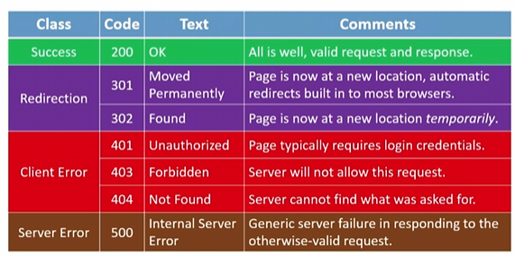
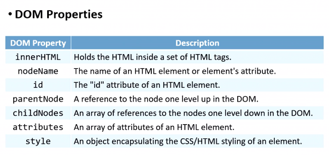
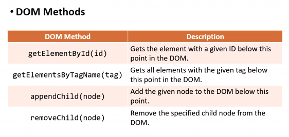

# webdev-learnings

## Internet

**IP** stands for Internet Protocol, the unique identification address of your devices.

* IPv4 (32bit) - format: #.#.#.# | example: 8.8.8.8 - # is number from 0 to 255
* IPv6 (128bit) - format: #:#:#:#:#:#:#:# | example: 2001:0db8:85a3:0000:0000:8a2e:0370:7334 - # hexadecimal - from 0000 to ffff
* IP splits data into  *********packets********* .

**DHCP** stands for Dynamic Host Configuration Protocol

**TCP** stands for Transmission Control Protocol, you can think of a port number when talking about this one. ******where****** the receiver is and *****what***** the packet is for, then it makes TCP/IP an inseparable pair. It guarantees delivery.

* 80 → HTTP stands for Hypertext Transfer Protocol
* 443 → HTTPS stands for Hypertext Transfer Protocol Security
* 53 → DNS
* 25 → SMTP stands for Simple Mail Transfer Protocol
* 21 → FTP stands for File Transfer
* DDS stands for Data Distribution Service
* RDP stands for Remote Desktop Protocol
* XMPP stands for Extensible Message and Presence Protocol


**DNS** stands for Domain Name System, which collects servers (hosts) and domains. It translates the IP addresses to the fully qualified domain name (with www.). Decentralize. One domain can link to many servers.

**Access Points** make you think of a *********router,********* a *********modem********* or a  **switch** . The IP address is assigned to the  *******router******* . Your devices connect to the ******router****** using private IP addresses. The ******router****** connects to the internet using the assigned IP address (public IP address).

********HTTP******** is one such example of an  *******************application layer protocol******************* .



```yaml
# request
GET / HTTP/1.1
Host: www.example.com
...

GET /search?q=cats HTTP/1.1
Host: www.google.com
...

# response 200 / class:Success / text:OK
HTTP/1.1 200 OK
Content-type: text/html
...

# response 301 / class:Ridirection / text:Moved Permanently
HTTP/1.1 301 Moved Permanently
Content-type: text/html
...

# response 404 / class:Client Error / text:Not Found
HTTP/1.1 404 Not Found
Content-type: text/html
...
```

## HTML

```html
<!DOCTYPE html>
<html lang="en">
<head>
	<title>hello, title</title>
</head>
<body>
	<header></header>
	<main></main>
	<footer></footer>
<body>
</html>
```

## CSS

```css
*{
	margin: 0;
	padding: 0;
	box-sizing: border-box;
	border: none;
	outline: none;
	text-decoration: none;
	list-style: none;
	font-family: system-ui, sans-serif;
}
html{
	line-height: 1.4;
	scroll-behavior: smooth;
}
body{
	line-height: 1.5;
	overflow-x: hidden;
}
```

## JavaScript

```javascript
// Variables
let counter = 0;
counter += 1;
counter ++;

// If-else statement
if (x < y)
{}
else if (x > y)
{}
else
{}

// Loops
for (var key in object) // this one will return the key
{
	// use object[key] in here
}

for (var key of object) // this one will return the actual value of the key
{
	// use key in here
}

// Arrays
var nums = [1, 2, 3, 4, 5];
var mixed = [1, true, 3.333, 'five'];

// Objects - can behave as an object-oriented programming language | keywords: properties, methods
// Functions can be anonymous (without a name)
object.function();
var herbie = {year: 1963, model: 'Beetle'};

var nums = [1, 2, 3, 4, 5];

nums = nums.map(function(num) {
	return num * 2;
});

/*
Events - blur, change, click, drag, focus, keyup, load,
mouseover, mousedown, mouseup, submit, touchmove, unload

Event Handlers
*/
function alertName(event)
{
	var trigger = event.scrElement;
	alert('You clicked on ' + trigger.innerHTML);
}
```

### DOM (Document Object Model)

Organize the contents of the web page into JavaScript objects. DOM has **properties** and **methods.**

Need to know the DOM properties and DOM methods





We have four ways to consider when implementing JavaScript.

* Pure JavaScript
* Function
* Event Handlers
* jQuery [https://api.jquery.com](https://api.jquery.com)

### AJAX (Asynchronous JavaScript and XML)

Ajax is using jQuery.

To refresh a section of a page, instead of reloading entire page.

Five different states 0, 1, 2, 3, 4 → hopefully receive 200 (OK) status.

open() and send()

```javascript
function ajax_request(argument)
{
	var aj = new XMLHttpRequest();
	aj.onreadystatechange = function() {
		if (aj.readyState == 4 && aj.status == 200)
			// do something to the page
	};

	aj.open("GET", /* url */, true);
	aj.send();
}
```

To learn more: [http://api.jquery.com/jquery.ajax/](http://api.jquery.com/jquery.ajax/)

## Khái niệm viewport?

**meta viewport parameter?**

The **viewport meta tag** is an HTML tag that controls how your webpage is displayed on different devices. [It can be used to set the width, height, initial scale, maximum scale, and user-scalable properties of the viewport**1](https://developer.mozilla.org/en-US/docs/Web/HTML/Viewport_meta_tag)[2](https://www.w3schools.com/css/css_rwd_viewport.asp)**. For example:

`<meta name="viewport" content="width=device-width, initial-scale=1.0">`

[This tag tells the browser to set the viewport width to the device width and the initial zoom level to 1.0**3**](https://www.w3schools.com/tags/tag_meta.asp).

**nguyên tắc bất ngờ nhỏ nhất?**

Nguyên tắc bất ngờ nhỏ nhất (least astonishment) là một nguyên tắc thiết kế giao diện, thiết kế phần mềm và khoa học lao động. [Nguyên tắc này phát biểu rằng khi hai thành phần giao diện xung đột hoặc nhập nhằng, hành vi của chúng phải gây bất ngờ ít nhất cho người sử dụng**1](https://viblo.asia/p/mot-so-design-principles-trong-lap-trinh-ma-ban-nen-biet-eW65GvJOlDO)[2](https://www.tma.vn/Hoi-dap/Cam-nang-nghe-nghiep/Nhung-nguyen-tac-nhung-dinh-luat-cua-lap-trinh-ma-chung-ta-nen-co-san-trong-dau/21724)**.

## Media query (@media)

```css
@media not|only media-type and (media-feature and|or|not media-feature)
{
	CSS Code;
}
```

************Keywords************

not, only, and, or

**********************Media types**********************

print → for the content that is printed.

screen → for the content that is on the screen of your devices (laptop, desktop, mobile, tablet)

speech

all - default

****************************Media features****************************

min-width → width ≥ giá trị defined → áp dụng

max-width → width ≤ giá trị defined → áp dụng

…

******************Polyfill?******************

Sử dụng media query cho những trình duyệt quá cổ. Search từ khóa **respond.js polyfill cdn**

Condition comment → use it to define the block of HTML code only uses for certain browsers.

Có thể tạo nhiều file CSS rồi link nó vào HTML đang làm. Mỗi cái link có thể đặt kiểu `media` khác nhau. Nhưng nên hạn chế sử dụng, tăng hiệu năng load website.

```html
<link rel="stylesheet" media="print" href="">
<link rel="stylesheet" media="screen" href="">
<link rel="stylesheet" media="(min-width: 1024px)" href="">
<link rel="stylesheet" media="(max-width: 740px)" href="">
```

## Breakpoints

The spot where the website will be changed to make responsive UI.

media query common breakpoints - PC, tablet, and mobile

## Dùng PX, REM hay EM

Chốt lại sử dụng `em`. Tuy nhiên cũng nên cân nhắc tùy trường hợp mà có thể sử dụng kết hợp `rem` và `em`.

*Link to know more about PX, EM vs REM: [https://zellwk.com/blog/media-query-units/*](https://zellwk.com/blog/media-query-units/*)

## Responsive NavBar - simple make perfect

Sử dụng label cho thành phần như hamburger, close buttons.

Sử dụng checkbox cho thành phần xác định on/off của mobile NavBar

Và sử dụng CSS selector cho thành phần ẩn và hiện mobile NavBar theo checkbox. checked → hiện , unchecked → ẩn.

*Link to know more about CSS selectors: [https://www.w3schools.com/cssref/css_selectors.php*](https://www.w3schools.com/cssref/css_selectors.php*)

## Grid

1. Xuất hiện vào thế kỷ 20, và còn được gọi là Constructivism trong nghệ thuật và kiến trúc.
2. Tạo nên bộ khung hỗ trợ cho việc sắp xếp bố cục theo trật tự, thống nhất và cân bằng
3. Grid system thường gặp

   1. Multicolumn grid
   2. Single column grid (mobile design)
   3. Modular grid
   4. Baseline grid
4. Vai trò

   1. Tổ chứ: dễ dàng sắp xếp thành phần trên các đường căn gióng tiện lợi
   2. Cân bằng: Mang lại cái nhìn trực quan và đảm bảo cho sự đối xứng hay bất đối xứng
   3. Tách biệt thành phần: Phân chia và tạo khoản cách thành phần nội dung hiệu quả
5. Ứng dụng

   1. Grid in UI/UX: quan trọng trong việc làm Responsive website
   2. Grid in printing

### Thành phần

* Grid: parent element
* Row
* Column
  Dùng % để tạo tính tương đối cho width, tương thích với độ rộng của màn hình thiết bị. PC 12|16 columns, tablet 8 columns, mobile 4 columns.
* Gutter (gap)
  Khoảng cách 2 bên của một column. PC/tablet 24px, mobile 16px.
* Margin
  Khoảng cách của cái grid mới màn hình.
